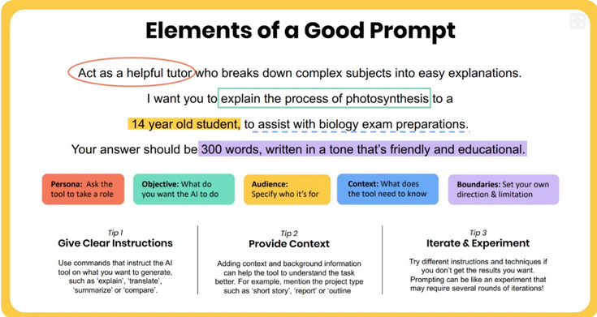
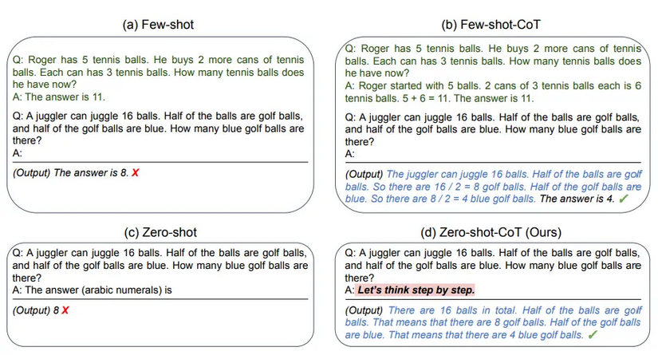

# Prompt Engineering

## Table of Contents
### 1. [What is Prompt Engineering?](#1-what-is-prompt-engineering-1)
### 2. [Why is Prompt Engineering Important?](#2-why-is-prompt-engineering-important-1)
### 3. [What is a Prompt?](#3-what-is-a-prompt-1)
### 4. [What are the main components of a good prompt?](#4-what-are-the-main-components-of-a-good-prompt-1)
### 5. [What happens when prompts are vague?](#5-what-happens-when-prompts-are-vague-1)
### 6. [Types of Prompting Techniques](#6-types-of-prompting-techniques-1)
### 7. [What are Constraints in prompts?](#7-what-are-constraints-in-prompts-1)
### 8. [What is Output Formatting in prompts??](#8-what-is-output-formatting-in-prompts-1)
### 9. [Summary](#9-summary-1)
---

## 1. ***What is Prompt Engineering?***
- Prompt Engineering is the process of designing and refining prompts to effectively communicate with AI models, ensuring they generate accurate and relevant responses.
- It involves structuring instructions, providing context, and setting constraints to improve model performance on tasks like reasoning, coding, and creative writing.

---

## 2. ***Why is Prompt Engineering Important?***
- It enhances the quality of AI-generated responses, making them more useful and relevant to user needs.
- Effective prompt engineering can reduce ambiguity, improve accuracy, and enable AI models to perform complex tasks that require reasoning and creativity.
- It is crucial for applications in various domains, including customer service, content creation, and data analysis.

---

## 3. ***What is a Prompt?***
- A prompt is a set of instructions or input provided to an AI model to elicit a specific response or perform a particular task.
- It can include questions, statements, or commands that guide the model's output.
- What you Write to LLM is considered a prompt.
- Example: 
    1. "Write a poem about the sea."
    2. "What is the capital of France?"

---

## 4. ***What are the main components of a good prompt?***
- **Clarity**: The prompt should be clear and unambiguous, providing specific instructions to the model.
- **Objective**: The prompt should have a clear objective or goal, guiding the model towards generating responses that meet the desired outcome.
- **Context**: Providing relevant background information can help the model understand the task better and generate more accurate responses.
- **Constraints**: Setting limits on the response, such as word count or format, can help guide the model to produce more focused and relevant outputs.
- **Examples**: Providing examples of desired outputs can help the model understand the expected response format and content.
- **Relevance**: The prompt should be relevant to the task at hand, ensuring that the model generates responses that are useful and applicable.
- **Specificity**: The prompt should be specific enough to guide the model towards the desired output, avoiding vague or general instructions.
- **Audience**: Understanding the target audience can help tailor the prompt to generate responses that are relevant and appropriate for that audience.
- **Feedback Loop**: Incorporating feedback from users and the model's responses can help refine the prompt and improve its effectiveness in generating accurate and relevant outputs.

<p style="text-align: center;">────────────</p>

<div align="center">
    
</div>

---

## 5. ***What happens when prompts are vague?***
- Vague prompts can lead to ambiguous or irrelevant responses from the AI model, as it may struggle to understand the user's intent or the specific task at hand.
- This can result in outputs that are off-topic, incomplete, or not useful for the user's needs.
- 🔴 For example, a prompt like "Tell me something interesting" is vague and may lead to a wide range of responses that may not align with the user's expectations or interests.
- 🟢 In contrast, a more specific prompt like "Tell me an interesting fact about space exploration" provides clearer guidance to the model, increasing the likelihood of generating a relevant and informative response.


---

## 6. ***Types of Prompting Techniques***
### 1. **Zero-Shot Prompting**: 
  - Providing a prompt without any examples or context, relying solely on the model's pre-trained knowledge to generate a response.
  - Example: "What is the capital of France?", "who is the president of the United States?" 
  - 🟢 This technique can be effective for straightforward questions or tasks that the model is likely to have encountered during training.
  - 🔴 However, it may not perform well for more complex tasks that require reasoning or creativity, as the model may struggle to generate accurate responses without additional guidance.
    - For instance, a zero-shot prompt like "Write a story about a dragon" may yield a generic response that lacks creativity or depth, as the model may not have enough context to generate a compelling narrative.

<p style="text-align: center;">────────────</p>

### 2. **Few-Shot Prompting**:
  - Providing a prompt along with a few examples of the desired output to guide the model's response.
  - Example: prompt: "Classification Problem: Here are some examples: (Happy -> Positive, Sad -> Negative). Now classify these words: Wonderful -> ??, Marvelous -> ??, Miserable -> ??"
      ```
        Based on the examples provided:
        Wonderful -> Positive
        Marvelous -> Positive
        Miserable -> Negative
      ```
  - 🟢 This technique can help improve the model's performance on tasks that require specific formatting or content, as it provides clear examples for the model to follow.
  - 🔴 However, it may still struggle with tasks that require more complex reasoning or creativity, as the examples may not cover all possible scenarios or variations of the task.

<p style="text-align: center;">────────────</p>

### 3. **Chain-of-Thought Prompting (CoT)**:
  - Encouraging the model to generate a step-by-step reasoning process to arrive at a final answer, rather than providing a direct response.
  - It helps the model solve:
    - Math problems
    - Logic questions
    - Multi-step reasoning tasks
    - Complex decision-making problems
  - Example: Prompt: "If Ahmed has 5 apples and buys 3 more, How many apples does he have now? Think, step by step."
      ```
        Step 1: Ahmed starts with 5 apples.
        Step 2: Ahmed buys 3 more apples, so he adds 3 to his original 5.
        Step 3: Ahmed now has 5 + 3 = 8 apples.
        Final Answer: Ahmed has 8 apples.
      ```
  - 🟢 This technique can be effective for tasks that require multi-step reasoning or problem-solving, as it encourages the model to break down the task into smaller, more manageable steps.
  - 🔴 However, it may not always lead to accurate responses if the model's reasoning process is flawed or if it struggles to maintain coherence across multiple steps.

<p style="text-align: center;">────────────</p>

#### Combining Techniques:
- In practice, you can combine different prompting techniques to achieve better results. For example, you might use few-shot prompting to provide examples and then encourage chain-of-thought reasoning to guide the model through a complex problem-solving process.
- Same with zero-shot prompting, you can also use it in combination with other techniques to provide a baseline response and then refine it with additional context or examples.

<div align="center">
    
</div>

### 4. **Self-Consistency Prompting**:
  - An advanced prompt engineering technique that improves LLM accuracy on complex reasoning tasks by generating multiple, diverse reasoning paths for a single query and selecting the most consistent answer among them.
  - Instead of relying on a single output, it uses a "majority vote" to identify the most reliable solution.
  - It's like having multiple experts independently solve a problem and then choosing the answer that most of them agree on, which can lead to more accurate and robust results, especially for tasks that require complex reasoning or have multiple valid solutions.

<p style="text-align: center;">────────────</p>

#### difference between CoT and Self-Consistency Prompting:

|Chain-of-Thought	|Self-Consistency|
|-----------------|--------------------|
|Uses one reasoning path	|Uses multiple reasoning paths|
|Step-by-step reasoning	|Multiple step-by-step solutions|
|Faster	|More computationally expensive|
|Can still follow one wrong path	|Reduces chance of wrong reasoning|

<p style="text-align: center;">────────────</p>

### There are also other prompting techniques such as:
- **Instruction Prompting**: Providing explicit instructions to guide the model's response.
- **Contextual Prompting**: Providing relevant background information to help the model understand the task better.
- **Role-Playing Prompting**: Asking the model to assume a specific role or perspective to generate a response that is relevant to that role.
- **Interactive Prompting**: Engaging in a back-and-forth dialogue with the model to refine the prompt and improve the response iteratively, like asking for clarification or additional details in the prompt itself.
- **Multimodal Prompting**: Incorporating multiple types of input (e.g., text, images, audio) to guide the model's response in a more comprehensive way.
- **Dynamic Prompting**: Adjusting the prompt in real-time based on the model's responses to guide it towards a more accurate or relevant output.
- etc.

---

## 7. ***What are Constraints in prompts?***
- Constraints are specific limitations or requirements that you can include in a prompt to guide the AI model.
- They help ensure that the model's response adheres to certain guidelines, such as word count, format, or content restrictions.
- Example: "Write a poem about the sea in exactly 4 lines and 8 words per line."
- 🟢 Constraints can help improve the relevance and usefulness of the model's response by providing clear guidelines for what is expected.
- 🔴 However, overly strict constraints may limit the model's creativity or ability to generate a comprehensive response, so it's important to find a balance between providing guidance and allowing for flexibility in the model's output.

---


## 8. ***What is Output Formatting in prompts??***
- Output formatting refers to the specific structure or format that you want the AI model to follow when generating a response.
- It can include requirements for how the response should be organized, such as using bullet points, numbered lists, or specific sections.
- Example: "Provide a summary of the article in bullet points, with each point being no more than 20 words."

---

## 9. ***Summary***
- Prompt Engineering is the process of designing and refining prompts to effectively communicate with AI models, ensuring they generate accurate and relevant responses.
- Effective prompt engineering can enhance the quality of AI-generated responses, making them more useful and relevant to user needs.
- A prompt is a set of instructions or input provided to an AI model to elicit a specific response or perform a particular task.
- The main components of a good prompt include clarity, objective, context, constraints, examples, relevance, specificity, audience, and feedback loop.
- Vague prompts can lead to ambiguous or irrelevant responses from the AI model, while specific prompts can guide the model towards generating more accurate and relevant outputs.
- There are various prompting techniques, including zero-shot prompting, few-shot prompting, chain-of-thought prompting, and self-consistency prompting, each with its own advantages and limitations.
- Constraints in prompts are specific limitations or requirements that guide the AI model's response, while output formatting refers to the specific structure or format that you want the model to follow when generating a response.
- Effective prompt engineering is crucial for maximizing the potential of AI models and ensuring that they generate responses that are useful, relevant, and aligned with user needs.