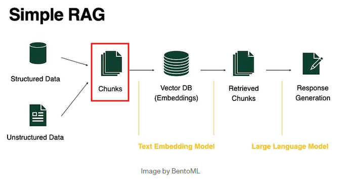
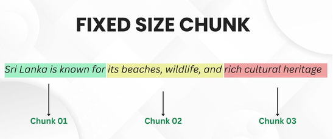
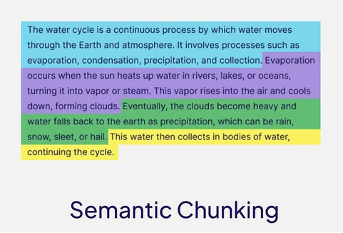
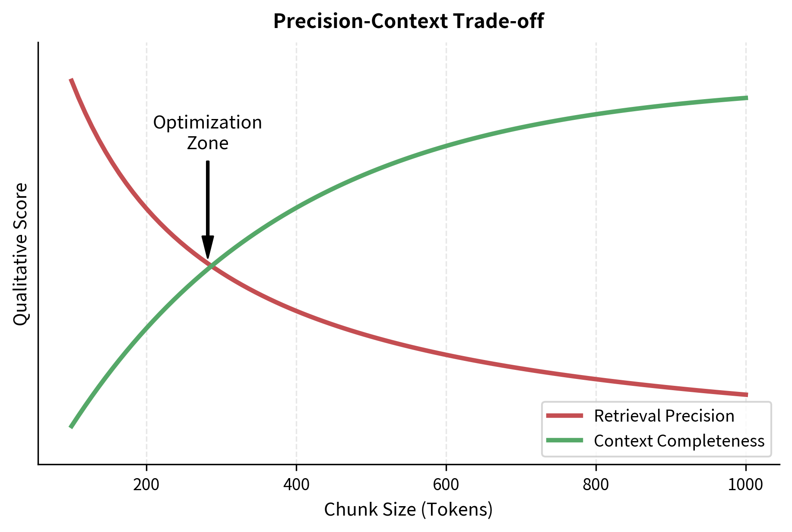

# Chunking in RAG

## Table of Contents

### 1. [What is Chunking and Why Does It Matter?](#1-what-is-chunking-and-why-does-it-matter)
#### __1.1 [Definition in context of RAG](#11-definition-in-context-of-rag)
#### __1.2 [Impact on retrieval quality and performance](#12-impact-on-retrieval-quality-and-performance)
#### __1.3 [Cost-performance tradeoffs](#13-cost-performance-tradeoffs)

### 2. [The Chunking Problem](#2-the-chunking-problem)
#### __2.1 [Why you can't just feed entire documents](#21-why-you-cant-just-feed-entire-documents)
#### __2.2 [Vector database constraints](#22-vector-database-constraints)
#### __2.3 [Context vs. noise balance](#23-context-vs-noise-balance)

### 3. [Fixed-Size Chunking](#3-fixed-size-chunking)
#### __3.1 [How it works](#31-how-it-works)
#### __3.2 [Advantages and Disadvantages](#32-advantages-and-disadvantages)
#### __3.3 [When to use it](#33-when-to-use-it)

### 4. [Semantic Chunking](#4-semantic-chunking)
#### __4.1 [How it works](#41-how-it-works)
#### __4.2 [Advantages and Disadvantages](#42-advantages-and-disadvantages)
#### __4.3 [When to use it](#43-when-to-use-it)

### 5. [Hybrid & Advanced Chunking Strategies](#5-hybrid--advanced-chunking-strategies)
#### __5.1 [Sliding window chunking](#51-sliding-window-chunking)
#### __5.2 [Recursive chunking](#52-recursive-chunking)
#### __5.3 [Metadata-aware chunking](#53-metadata-aware-chunking)

### 6. [Key Parameters That Matter](#6-key-parameters-that-matter)
#### __6.1 [Chunk size (optimal ranges)](#61-chunk-size-optimal-ranges)
#### __6.2 [Overlap and stride](#62-overlap-and-stride)

### 7. [Best Practices & Guidelines](#7-best-practices--guidelines)

---

## 1. What is Chunking and Why Does It Matter?
- we explained what is Embedding and how it works in the third session, now we will dive into the concept of chunking, which embeddings rely on to work effectively. [Go back to session 03](../session_03_Embedding/embeddings.md) 

### 1.1 Definition in context of RAG
- Chunking is the process of dividing large documents into smaller, meaningful units called chunks. Each chunk can then be embedded, indexed, and retrieved independently. Because RAG pipelines often rely on retrieval from vector databases and large language models (LLMs) with limited context windows, smart chunking can make all the difference in delivering relevant, context-rich answers.
- Chunking mainly occurs during the offline phase of RAG, where documents are split into smaller chunks and stored in a vector database. During the online phase, the system retrieves the most relevant pre-computed chunks and provides them to the LLM. Therefore, the quality of chunking directly affects the relevance of retrieved information and the quality of the generated answers.

<div align="center">

</div>

<p style="text-align:center;">────────────</p>

### 1.2 Impact on retrieval quality and performance
- Proper chunking can significantly improve retrieval quality by ensuring that each chunk contains coherent and relevant information. This allows the retrieval system to find more accurate matches for user queries, leading to better answers from the LLM.
- On the other hand, poor chunking can lead to fragmented information, where relevant context is split across multiple chunks, making it harder for the retrieval system to find the right pieces of information. This can result in less accurate answers and a poorer user experience.

<p style="text-align:center;">────────────</p>

### 1.3 Cost-performance tradeoffs
- Chunk Size (The Trade-off):
  - Small Chunks (~150-256 tokens): Improve precision and reduce hallucinations, as they focus heavily on exact topics. However, they often cause a loss of broader document context.
  - Large Chunks (~500+ tokens): Provide extensive context but can dilute or lose relevance, introducing noise and muddying (make confusing) the AI's focus.

---

## 2. The Chunking Problem
- You probably have noticed that when you feed an entire document to an LLM, it often struggles to provide accurate answers. This is because LLMs have a limited context window, which means they can only process a certain amount of text at a time. If the document is too long, the model may miss important information or context, leading to incomplete or incorrect answers.

### 2.1 Why you can't just feed entire documents
- LLMs have a maximum context window (e.g., 4k tokens for GPT-3.5, 8k tokens for GPT-4, and up to 32k tokens for GPT-4-turbo). If a document exceeds this limit, the model will truncate the text, potentially losing critical information. This is especially problematic for long documents, such as research papers, legal documents, or technical manuals, where context is crucial for understanding. (if you don't know what context window or tokens are, please refer to the [session 02](../session_02_LLM_API/LLM_Specific_Concepts.md) where i explained it.)

<p style="text-align:center;">────────────</p>

### 2.2 Vector database constraints
- Vector databases, which store embeddings of chunks, also have limitations on the size of the data they can handle efficiently. Large chunks can lead to increased storage requirements and slower retrieval times, as the database has to process more data for each query. Smaller, well-defined chunks allow for faster searches and more efficient use of resources.

<p style="text-align:center;">────────────</p>

### 2.3 Context vs. noise balance
- The goal of chunking is to strike a balance between providing enough context for the LLM to generate accurate responses and avoiding the introduction of noise that can confuse the model. Too much context can overwhelm the model, while too little can lead to incomplete answers. Effective chunking ensures that each chunk is coherent, relevant, and provides sufficient information for the LLM to work with.

There are several strategies for chunking, each with its own advantages and disadvantages. In the following sections, we will explore fixed-size chunking, semantic chunking, and hybrid approaches, along with their implementation details and best practices.

---

## 3. Fixed-Size Chunking

### 3.1 How it works
- Fixed-size chunking is a straightforward approach where documents are divided into chunks of a predetermined size, typically measured in tokens or characters.

<p style="text-align:center;">────────────</p>

### 3.2 Advantages and Disadvantages
- 🟢 Advantages:
  - Simplicity: Easy to implement and understand.
  - Consistency: Each chunk is of a uniform size, which can simplify processing and storage.
  - Efficiency: Can be faster to create and retrieve chunks, especially for large documents.
  - Works decently for content that doesn’t heavily rely on semantic context.
- 🔴 Disadvantages:
  - Ignores natural semantic breaks.
  - Loss of Context: May split important information across chunks, leading to fragmented context.
  - Noise Introduction: Can include irrelevant information in chunks, especially if the document has varying content density.

<p style="text-align:center;">────────────</p>

### 3.3 When to use it:
  - When dealing with large documents where simplicity and speed are priorities.
  - When the content is relatively uniform and does not require nuanced understanding of context.

<div align="center">

</div>

<p style="text-align:center;">────────────</p>

Check out the [code implementation](Chunking_Strategies/fixed_size_Chunking.py) for fixed-size chunking, which includes both a simple custom implementation and an example using LangChain's text splitter.

---

## 4. Semantic Chunking
### 4.1 How it works
- Semantic chunking, also known as intelligent chunking, involves dividing documents based on their semantic content rather than just size. This approach uses natural language processing techniques to identify logical breaks in the text, such as paragraphs, sentences, or even topics. The goal is to create chunks that are coherent and contextually meaningful, which can improve retrieval quality and relevance.

<p style="text-align:center;">────────────</p>

### 4.2 Advantages and Disadvantages
- 🟢 Advantages:
  - Preserves Context: By chunking based on semantic content, it maintains the integrity of information, reducing the chances of losing critical context.
  - Improved Relevance: Chunks are more likely to be relevant to user queries, as they are based on meaningful units of text.
  - Reduces Noise: By avoiding arbitrary splits, it minimizes the inclusion of irrelevant information in chunks.
- 🔴 Disadvantages:
  - Complexity: More complex to implement than fixed-size chunking, often requiring NLP techniques and tools.
  - Yields variable chunk sizes.
  - Computational Overhead: May require additional processing time to analyze the text and determine optimal chunk boundaries.

<p style="text-align:center;">────────────</p>

### 4.3 When to use it:
  - When dealing with documents that have a clear structure, such as articles, reports, or manuals.
  - When the quality of retrieval is a priority and you want to ensure that chunks are contextually meaningful.

<div align="center">

</div>

there are several approaches to semantic chunking, ranging from basic methods like sentence or paragraph splitting to more advanced techniques that leverage embeddings and clustering algorithms. Check out the [code implementation](Chunking_Strategies/semantic_Chunking.py) for semantic chunking, which includes examples of different strategies and their applications. (Note that the code is AI-generated and may require further refinement for production use.)


---


## 5. Hybrid & Advanced Chunking Strategies

- Hybrid chunking strategies combine elements of fixed-size and semantic chunking to leverage the strengths of both approaches. These methods aim to balance simplicity, context preservation, and retrieval performance.

### 5.1 Sliding Window Chunking

- Sliding window chunking creates overlapping chunks of text, where each chunk shares a portion of its content with adjacent chunks. This overlap helps preserve context across chunk boundaries, reducing the risk of losing important information when a document is split into smaller pieces.

- For example, with a chunk size of 100 words and an overlap of 20 words:
  - Chunk 1: Words 1–100
  - Chunk 2: Words 81–180
  - Chunk 3: Words 161–260

- Because neighboring chunks share content, information located near chunk boundaries remains accessible in multiple chunks, which can improve retrieval quality in RAG systems.

- 🟢 Advantages:
  - Preserves context across chunk boundaries.
  - Reduces the risk of losing critical information.
- 🔴 Disadvantages:
  - Increased storage requirements due to overlapping content.
  - More complex to implement and manage compared to non-overlapping chunking methods.

> **Note:** Unlike fixed-size chunking, where each chunk is independent and contains no shared content with neighboring chunks, sliding window chunking introduces overlap between consecutive chunks. This overlap helps preserve context across chunk boundaries and reduces the likelihood of losing important information during retrieval.


### 5.2 Recursive Chunking
- Recursive chunking is a hierarchical approach that involves breaking down documents into chunks at multiple levels of granularity. This method allows for the creation of both larger, context-rich chunks and smaller, more focused chunks, enabling flexible retrieval based on the needs of the query.

- Recursive chunking is **hierarchical fallback splitting**.
```
It does not randomly cut text at fixed intervals. Instead, it tries to preserve structure using an ordered list of separators:
  
  ["\n\n", "\n", " ", ""]

  This means:
      Try splitting by paragraph
      If chunk too large → split by line
      If still too large → split by word
      If still too large → split by character
```
It recursively degrades structure only when necessary.


- 🟢 Advantages:
  - Preserves document structure and context at multiple levels.
  - Allows for flexible retrieval based on query requirements.
- 🔴 Disadvantages:
  - More complex to implement and manage compared to simpler chunking methods.
  - May require additional processing time to analyze the document structure and determine optimal chunk boundaries.

### 5.3 Metadata-Aware Chunking

* Metadata-aware chunking uses document metadatasuch as titles, headings, sections, page numbers, timestamps, authors, or tags to guide how documents are divided into chunks. Rather than relying solely on text length or semantic similarity, this approach incorporates structural information to create chunks that better reflect the document's organization.

* For example, in a research paper, each section (Introduction, Methodology, Results, Conclusion) can be chunked separately. Similarly, in a knowledge base, chunks may be created based on article titles and subsection headings.

- 🟢 Advantages
  - Produces chunks that align with the document's structure and meaning.
  - Preserves important contextual information associated with each chunk.
  - Can improve retrieval relevance by allowing metadata-based filtering and search.

- 🔴 Disadvantages

  - Requires metadata to be available and properly extracted.
  - May not be suitable for unstructured documents that lack meaningful metadata.
  - More complex to implement than fixed-size or sliding window chunking.

## 6. Key Parameters That Matter
- we have discussed several chunking strategies, but the effectiveness of these methods often depends on key parameters that influence how chunks are created and managed. In this section, we will explore the most important parameters to consider when implementing chunking in RAG systems.

### 6.1 Chunk Size (Optimal Ranges)
- The size of each chunk is a critical parameter that can significantly impact retrieval quality and performance.
- The optimal chunk size depends on the nature of the documents and the retrieval task. Generally, chunks that are too small may lose context, while chunks that are too large may include irrelevant information. So it's important to find a balance that preserves context while minimizing noise.

<div align="center">
  
</div>

### 6.2 Overlap and Stride
- Overlap refers to the amount of shared content between consecutive chunks, while stride is the distance between the starting points of adjacent chunks. Adjusting these parameters can help preserve context across chunk boundaries and improve retrieval quality.
- For example, a chunk size of 100 words with an overlap of 20 words and a stride of 80 words would create chunks that share 20 words with their neighbors, ensuring that important context is retained.


---

## 7. Best Practices & Guidelines
- Optimal chunk size varies significantly based on your application domain and retrieval strategy. Here are evidence-based recommendations:

> **Note:** `Granularity` means the level of detail or size of chunks at which you break down your content.

### Technical Documentation & Code
**Recommended Size:** 512-1024 tokens (≈ 2-4 KB)
 
- **Rationale:** Code examples and technical details benefit from adequate context without overwhelming the embedding model
- **Best for:** API docs, code snippets, algorithm explanations
- **Example:** A function documentation block with signature, parameters, return types, and one usage example
- **Considerations:**
  - Keep logical code blocks intact (don't split a function across chunks)
  - Include both method signature and docstring together
  - Preserve code indentation and structure

<p style="text-align:center;">────────────</p>

### Academic & Research Papers
**Recommended Size:** 1024-2048 tokens (≈ 4-8 KB)
 
- **Rationale:** Academic writing contains dense concepts requiring broader context for meaning
- **Best for:** Research abstracts, methodology sections, literature reviews
- **Granularity:** Section or subsection-level chunks
- **Considerations:**
  - Avoid splitting equations or proofs
  - Keep related figures and their captions together
  - Preserve citation structures within chunks

<p style="text-align:center;">────────────</p>

### Product Documentation & Guides
**Recommended Size:** 512-1024 tokens (≈ 2-4 KB)
 
- **Rationale:** Users typically search for specific features or troubleshooting steps
- **Best for:** User manuals, feature documentation, tutorials
- **Granularity:** Feature or step-level chunks
- **Considerations:**
  - Group prerequisites with instructions
  - Include warning/note blocks with relevant section
  - Keep screenshots with associated explanatory text

<p style="text-align:center;">────────────</p>

### Customer Support & FAQs
**Recommended Size:** 256-512 tokens (≈ 1-2 KB)
 
- **Rationale:** Q&A format works well with shorter, focused chunks
- **Best for:** FAQ sections, support tickets, troubleshooting guides
- **Granularity:** Single Q&A pair per chunk
- **Considerations:**
  - Each question-answer pair is a natural chunk boundary
  - Short chunks improve retrieval precision
  - Easy to identify exact solution for user query


<p style="text-align:center;">────────────</p>


### Legal Documents & Contracts
**Recommended Size:** 1024-2048 tokens (≈ 4-8 KB)
 
- **Rationale:** Legal language requires full clause or section context
- **Best for:** Terms of service, privacy policies, contracts
- **Granularity:** Clause or article level
- **Considerations:**
  - Never split a clause or condition
  - Preserve definitions and cross-references
  - Keep related provisions together

<p style="text-align:center;">────────────</p>

### E-commerce & Product Catalogs
**Recommended Size:** 256-512 tokens (≈ 1-2 KB)
 
- **Rationale:** Discrete product information with separate attributes
- **Best for:** Product descriptions, specifications, reviews
- **Granularity:** Individual product or SKU (Stock Keeping Unit)
- **Considerations:**
  - One product per chunk (with all its attributes)
  - Include title, description, specs, and price in same chunk
  - Aggregate related metadata

<p style="text-align:center;">────────────</p>

### News & Blog Articles
**Recommended Size:** 512-1024 tokens (≈ 2-4 KB)
 
- **Rationale:** Balance between full story context and query specificity
- **Best for:** News archives, blog posts, articles
- **Granularity:** Paragraph or section level
- **Considerations:**
  - Keep headline with opening paragraph
  - Preserve narrative flow for better semantic meaning
  - Include byline and publication date

<p style="text-align:center;">────────────</p>

### Time-Series & Financial Data
**Recommended Size:** 256-768 tokens (≈ 1-3 KB)
 
- **Rationale:** Data density is high; shorter chunks improve precision
- **Best for:** Financial reports, metrics, time-series analysis
- **Granularity:** Data point or reporting period
- **Considerations:**
  - Group related metrics together
  - Include timestamp/period information
  - Preserve numerical context
---


<p align="center">
  <strong style="font-size:32px; letter-spacing:6px;">
    — THE END —
  </strong>
</p>